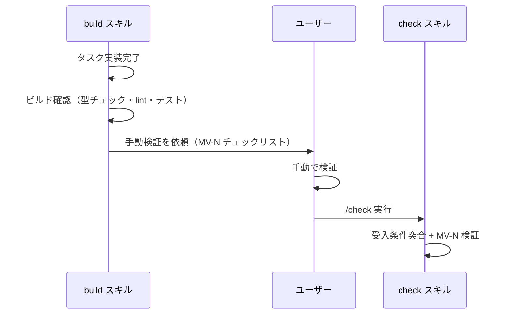
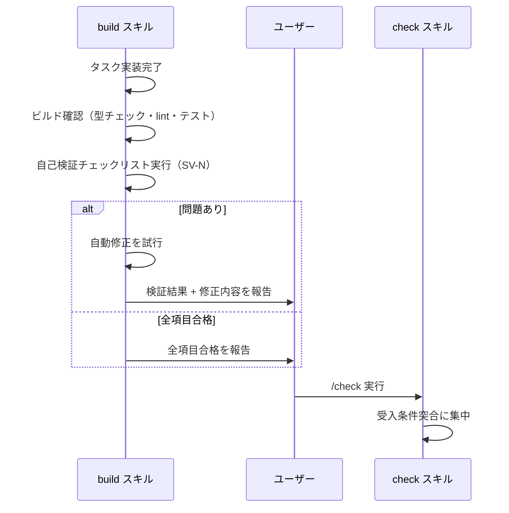
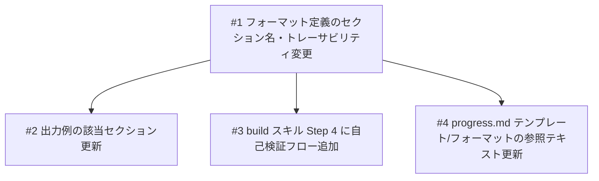

# build 自己検証チェックリスト

## 概要

plan.md の「手動検証チェックリスト」セクションを「自己検証チェックリスト」に変更し、build スキルが実装完了後にチェックリスト項目を自己検証・自動修正してから verify（check）に進めるようにする。これにより verify 前に実装品質を高め、check スキルは受入条件の突合に集中できる。

### 自己検証チェックリストの項目形式

自己検証チェックリストは、受入条件を具体的な操作手順・確認手順に落とし込んだチェック項目のリストである。形式は従来の「手動検証チェックリスト」（`MV-N`）と同一で、ID プレフィックスのみ `SV-N`（Self-Verify）に変更する。

```
- [ ] SV-1: {具体的な検証手順と期待結果}
- [ ] SV-2: {具体的な検証手順と期待結果}
```

例: `- [ ] SV-1: メモ詳細画面でリマインダーアイコンをタップし、日時選択UIが表示されること`

build スキルはこれらの項目を 1 つずつ検証し、不合格の場合は自動修正を試みる。

## 確認事項

| # | 項目 | 根拠 | ステータス |
|---|------|------|-----------|
| 1 | 「自己検証」の名称衝突 | writer エージェント内部にも「自己検証チェックリスト」があるが、それは plan.md 本文には出力されないため被らない | ✅確認済み |
| 2 | 自己検証の不合格時フロー | 自動修正を試みる方針に決定済み | ✅確認済み |
| 3 | check との役割分担 | build が自己検証（SV-N）、check は受入条件突合に集中 | ✅確認済み |

## スコープ

### やること

- `agents/writer/references/formats/plan.md` の「手動検証チェックリスト」セクション名・形式を「自己検証チェックリスト」に変更
- `agents/writer/references/examples/plan.md` の該当セクションを更新
- `skills/build/SKILL.md` の Step 4 に自己検証実行フローを追加（チェックリスト各項目を検証 → 問題あれば自動修正 → 結果報告）
- `agents/writer/references/formats/plan.md` のトレーサビリティテーブルの「手動検証」列を「自己検証」に変更
- `agents/writer/references/templates/progress.md` 内の「手動検証」参照テキストを更新（該当があれば）

### やらないこと

- 既存の plan.md の一括書き換え（後方互換で問題なし）
- check スキルの大幅な変更（check は既に受入条件突合が主務）
- writer エージェント内部の「自己検証チェックリスト」（セクション間整合性チェック）の変更

## 受入条件

- [ ] AC-1: plan.md フォーマット定義で「手動検証チェックリスト」が「自己検証チェックリスト」に変更されていること
- [ ] AC-2: plan.md の出力例でセクション名と項目が自己検証形式（`SV-N`）に更新されていること
- [ ] AC-3: build スキルの Step 4 で、自己検証チェックリスト（受入条件を具体的な検証手順に落とし込んだ `- [ ] SV-N: {検証手順と期待結果}` 形式の項目リスト）の各項目を検証し、問題があれば自動修正を試みるフローが追加されていること
- [ ] AC-4: 自己検証の結果（合格/不合格+修正内容）がユーザーに報告されること
- [ ] AC-5: check スキルは受入条件の突合に集中する形になり、SV-N チェックリストの検証は build 側に移行していること

## 非機能要件

特になし

## データフロー

### 変更前: build 完了フロー



### 変更後: build 完了フロー



## 設計判断

| 判断事項 | 選択 | 理由 | 検討した代替案 |
|---------|------|------|--------------|
| セクション名の変更方針 | 「手動検証チェックリスト」→「自己検証チェックリスト」 | build が自動で検証するため「手動」が不適切になる | 「ビルド後検証チェックリスト」 -- 自己検証の意図が伝わりにくい |
| ID プレフィックス | `MV-N` → `SV-N` | Self-Verify の略。手動検証との区別を明確にする | `BV-N`（Build Verify） -- 汎用性が低い |
| 名称衝突の対応 | 許容する | writer 内部の「自己検証チェックリスト」は plan.md 本文に出力されないため実害なし | 片方をリネーム -- 変更範囲が広がる |
| 自動修正の方針 | 問題検出時に自動修正を試みる | verify 前に品質を高めることが目的 | 問題報告のみ -- ユーザーの手間が増える |

## システム影響

### 影響範囲

- `agents/writer/references/formats/plan.md`: セクション名・トレーサビリティテーブル・ID プレフィックス変更
- `agents/writer/references/examples/plan.md`: 出力例の該当セクション更新
- `skills/build/SKILL.md`: Step 4 に自己検証フロー追加
- `agents/writer/references/templates/progress.md`: 「手動検証」テキスト更新（該当があれば）
- `agents/writer/references/formats/progress.md`: 同上

### リスク

- 既存の plan.md との後方互換性: 既存 plan.md は `MV-N` のまま残るが、build スキルは `SV-N`/`MV-N` 両方を認識すれば問題なし
- writer 内部の「自己検証チェックリスト」との名称衝突: plan.md 本文には出力されないため実害なし

## 実装タスク

### 依存関係図



### タスク一覧

| # | タスク | 対象ファイル | 見積 | 依存 |
|---|--------|------------|------|------|
| 1 | plan.md フォーマット定義の「手動検証チェックリスト」→「自己検証チェックリスト」変更 + トレーサビリティテーブル列名変更 | `agents/writer/references/formats/plan.md` | S | - |
| 2 | plan.md 出力例の該当セクション更新（セクション名・ID プレフィックス・項目内容） | `agents/writer/references/examples/plan.md` | S | #1 |
| 3 | build スキル Step 4 に自己検証実行フローを追加（チェックリスト検証 → 自動修正 → 結果報告） | `skills/build/SKILL.md` | M | #1 |
| 4 | progress.md テンプレート/フォーマット内の「手動検証」参照テキストを「自己検証」に更新 | `agents/writer/references/templates/progress.md`, `agents/writer/references/formats/progress.md` | S | #1 |

> 見積基準: S(~1h), M(1-3h), L(3h~)

## テスト方針

### トレーサビリティ

| 受入条件 | 自動テスト | 自己検証 |
|---------|-----------|---------|
| AC-1 | - | SV-1 |
| AC-2 | - | SV-2 |
| AC-3 | - | SV-3 |
| AC-4 | - | SV-3 |
| AC-5 | - | SV-3 |

### 自動テスト

該当なし（Markdown ドキュメントの変更のみのため）

### ビルド確認

```bash
# Markdown ファイルの変更のみのため、ビルドコマンドは不要
# 変更対象ファイルの存在確認
ls agents/writer/references/formats/plan.md
ls agents/writer/references/examples/plan.md
ls skills/build/SKILL.md
```

### 自己検証チェックリスト

- [ ] SV-1: `agents/writer/references/formats/plan.md` で「手動検証チェックリスト」が「自己検証チェックリスト」に変更されており、トレーサビリティテーブルの列名も「自己検証」になっていること
- [ ] SV-2: `agents/writer/references/examples/plan.md` で該当セクション名が「自己検証チェックリスト」に変更され、項目 ID が `SV-N` 形式になっていること
- [ ] SV-3: `skills/build/SKILL.md` の Step 4 で、自己検証チェックリストの各項目を検証し、問題があれば自動修正を試み、結果をユーザーに報告するフローが記述されていること
- [ ] SV-4: `agents/writer/references/formats/plan.md` のトレーサビリティテーブルで「手動検証」列が「自己検証」列に変更されていること
