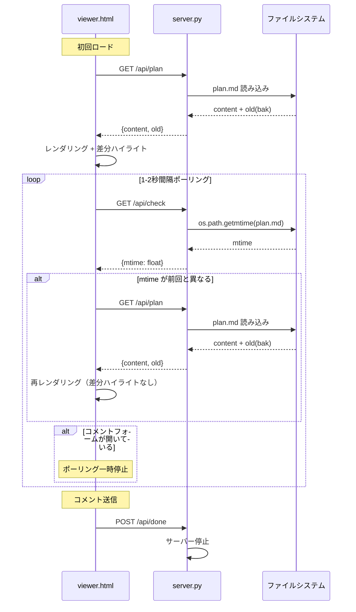
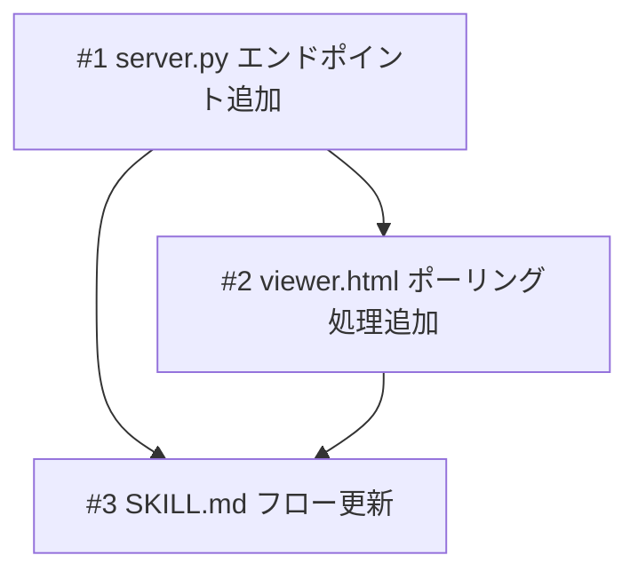

# ライブリロードプレビュー

## 概要

annotation-viewer（plan.md ブラウザプレビュー）にポーリングベースのライブリロード機能を追加する。現在の「サーバー停止 -> 修正 -> サーバー再起動 -> ブラウザ再open」ループを廃止し、ブラウザを開きっぱなしにしたまま plan.md の変更が自動反映されるようにする。

## ユーザーストーリー

- US-1: 仕様レビュー者として、plan.md が更新されたらブラウザが自動で最新内容を表示してほしい。なぜならブラウザを閉じ開きする手間をなくしたいから。

## 受入条件

- [ ] AC-1: server.py に GET `/api/check` エンドポイントが追加され、plan.md の mtime を JSON で返す
- [ ] AC-2: viewer.html が 1-2秒間隔でポーリングし、mtime 変更を検知したら `/api/plan` を再 fetch してコンテンツを再レンダリングする
- [ ] AC-3: 再レンダリング時にスクロール位置が保持される
- [ ] AC-4: 再レンダリング時に mermaid ダイアグラムと highlight.js が正しく再実行される
- [ ] AC-5: コメント入力中（コメントフォームが開いている間）はポーリングを一時停止する
- [ ] AC-6: plan.md.bak の差分ハイライトは初回ロード時のみ適用し、ポーリング更新時は最新内容のみ表示する
- [ ] AC-7: SKILL.md の Step 4-c がサーバー再起動ループではなく、サーバー開きっぱなしのフローに更新される
- [ ] AC-8: コメント送信（POST `/api/done`）時のサーバー停止動作は維持される

## スコープ

### やること

- server.py に mtime 確認エンドポイント追加
- viewer.html にポーリング処理と再レンダリング機構の追加
- SKILL.md のレビューフロー更新（サーバー再起動ループの廃止）

### やらないこと

- WebSocket によるリアルタイム通知
- ブラウザ内チャット機能
- 外部ツール連携

## 非機能要件

- 特になし

## データフロー

### ポーリングによるライブリロードフロー



## バックエンド変更

### API設計

| メソッド | パス | 説明 |
|---------|------|------|
| GET | `/api/check` | plan.md の mtime を返す |

- 入力: なし
- 出力: `{"mtime": float}` （`os.path.getmtime()` の戻り値）
- エラーケース: plan.md が存在しない場合 -> 404

既存エンドポイント（GET `/api/plan`, POST `/api/done`）は変更なし。

### 対象ファイル

- 変更: `scripts/annotation-viewer/server.py` -- GET `/api/check` エンドポイント追加

## フロントエンド変更

### 画面・UI設計

- 画面レイアウトの変更はなし
- バックグラウンドでポーリング処理が動作し、plan.md の変更を自動検知して再レンダリングする
- ユーザーが行う操作に変更はない（自動で更新される）
- 再レンダリング時のスクロール位置保持により、レビュー中の位置を維持する

### 動作仕様

| 項目 | 仕様 |
|------|------|
| ポーリング間隔 | 1-2秒（`setInterval`） |
| mtime 比較 | 前回取得した mtime とレスポンスの mtime を比較 |
| 再レンダリング処理 | `marked.parse()` -> mermaid コードブロック変換 -> `mermaid.run()` -> `hljs.highlightAll()` -> `wrapSections()` |
| スクロール保持 | `scrollTop` を保存・復元 |
| コメントモード | グローバルフラグで制御。コメントフォーム表示中はポーリング停止 |
| 差分ハイライト | 初回ロードのみ `applyDiffHighlights` を実行。ポーリング更新時はスキップ |

### 対象ファイル

- 変更: `scripts/annotation-viewer/viewer.html` -- ポーリング処理・再レンダリング機構の追加

## 設計判断

| 判断事項 | 選択 | 理由 | 検討した代替案 |
|---------|------|------|--------------|
| 変更検知方式 | ポーリング（mtime 比較） | Python 3 標準ライブラリのみで実現可能。サーバー側の実装が最小限 | WebSocket -- 外部ライブラリが必要。プロジェクト規約に反する |
| ポーリング間隔 | 1-2秒 | ローカル環境のため負荷は問題にならない。体感的に十分な反応速度 | 5秒 -- 反応が遅い。100ms -- 不要に頻繁 |
| 差分ハイライトの扱い | 初回のみ適用 | ポーリング更新時に差分ハイライトを再適用すると、bak と最新の差分が常に表示され混乱する | 毎回適用 -- 更新のたびに差分が変化し見づらい |

## システム影響

### 影響範囲

- `scripts/annotation-viewer/server.py`: エンドポイント追加（既存エンドポイントへの影響なし）
- `scripts/annotation-viewer/viewer.html`: ポーリング処理追加（既存の初回ロード・コメント機能への影響なし）
- `skills/spec/SKILL.md`: Step 4-c のフロー記述変更

### リスク

- ポーリング中にサーバーが停止した場合の fetch エラー -> ブラウザ側で fetch エラーをキャッチし、ポーリングを継続（サーバー再起動時に自動復帰）
- mermaid.run() の再実行時に既存の描画済み要素が残る可能性 -> 再レンダリング前に innerHTML をクリアすることで対応

## 実装タスク

### 依存関係図



### タスク一覧

| # | タスク | 対象ファイル | 見積 | 依存 |
|---|--------|------------|------|------|
| 1 | GET `/api/check` エンドポイント追加 | `scripts/annotation-viewer/server.py` | S | - |
| 2 | ポーリング処理・再レンダリング機構追加 | `scripts/annotation-viewer/viewer.html` | M | #1 |
| 3 | Step 4-c フロー更新 | `skills/spec/SKILL.md` | S | #1, #2 |

> 見積基準: S(~1h), M(1-3h), L(3h~)

## テスト方針

### トレーサビリティ

| 受入条件 | 自動テスト | 手動検証 |
|---------|-----------|---------|
| AC-1 | - | MV-1 |
| AC-2 | - | MV-1 |
| AC-3 | - | MV-2 |
| AC-4 | - | MV-3 |
| AC-5 | - | MV-4, MV-5 |
| AC-6 | - | MV-7, MV-8 |
| AC-7 | - | - |
| AC-8 | - | MV-6 |

### ビルド確認

```bash
python3 scripts/annotation-viewer/server.py docs/plans/live-reload-preview
```

### 手動検証チェックリスト

- [ ] MV-1: サーバー起動 -> ブラウザ open -> plan.md を手動編集 -> ブラウザが自動で更新されること
- [ ] MV-2: 更新時にスクロール位置が維持されること
- [ ] MV-3: mermaid ダイアグラムが更新後も正しく描画されること
- [ ] MV-4: コメントフォーム表示中に plan.md を更新 -> ポーリングが停止していること
- [ ] MV-5: コメントフォームを閉じた後にポーリングが再開し、変更が反映されること
- [ ] MV-6: コメント送信 -> サーバーが停止すること（既存動作の維持）
- [ ] MV-7: plan.md.bak がある場合、初回表示で差分ハイライトが表示されること
- [ ] MV-8: plan.md.bak がある場合でも、ポーリング更新では差分ハイライトが表示されないこと
