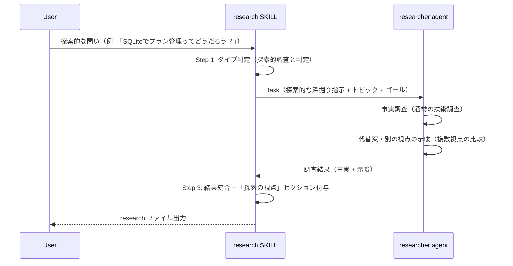
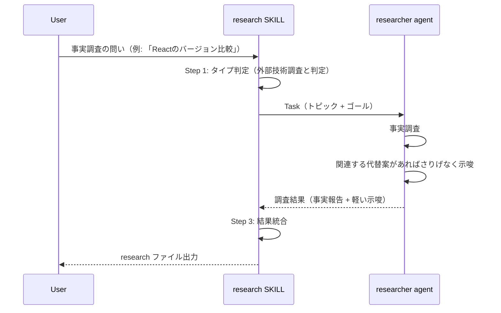
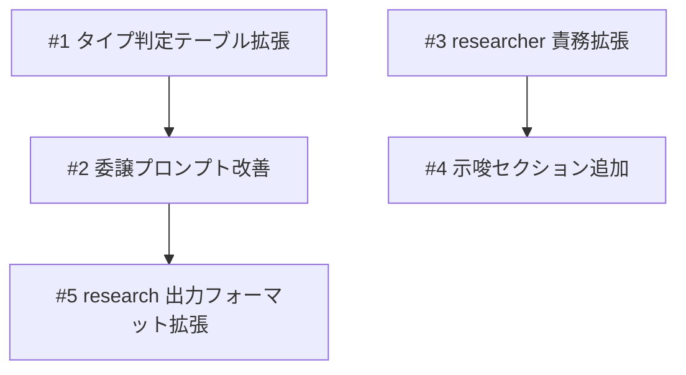

# research スキルの柔軟な視点探索

## 概要

`/research` スキルが「現行アーキテクチャの制約内」で評価して早期に保守的結論を出す傾向を修正する。探索的な問いに対して、前提を疑い多角的な視点（現行改善 / 代替アプローチ / ハイブリッド等）を自発的に提示する能力を付与する。モードを明示的に分けるのではなく、researcher が常に「別の視点がありそうならさりげなく示唆する」柔軟な姿勢を持つようにする。

## 確認事項

| # | 項目 | 根拠 | ステータス |
|---|------|------|-----------|
| 1 | researcher の DON'T「スコープ外の調査をしない」(L86) を緩和する範囲 — 完全撤去 vs 条件付き緩和 | `agents/researcher/researcher.md:L86` | ✅確認済み: 緩和（代替案や別の視点がありそうな場合にさりげなく示唆することを許可） |
| 2 | researcher の「設計提案や実装コードを書かない」(L84) との整合 | `agents/researcher/researcher.md:L84` | ✅確認済み: 「設計の示唆・代替案の列挙」は許可、「具体的な設計提案（API設計等）」は引き続き禁止 |
| 3 | 探索の深さ制御 — 毎回深い探索をすると冗長になる | `skills/research/SKILL.md` のタイプ判定 | ✅確認済み: research スキル側で探索的テーマかどうかを判定し、researcher に指示する。ただし事実調査でも軽い示唆は許容する |

## 追加検討事項

| # | 観点 | 詳細 | 根拠 |
|---|------|------|------|
| 1 | build/fix からの researcher 利用に影響しないことの確認 | モードを明示的に分けず、researcher は常に事実報告を主軸としつつ、代替案や別の視点がありそうな場合はさりげなく示唆を添える。build/fix からの利用時も事実報告に加えて軽い示唆があっても問題ない | `skills/build/SKILL.md:L71-L78`, `skills/fix/SKILL.md:L146-L154` |
| 2 | spec スキルとの連携 | research が代替案の示唆を含む場合、spec がどう扱うかは現行の「参考情報として拘束しない」で十分 | `skills/spec/SKILL.md:L57-L65` |

## スコープ

### やること

- research SKILL.md のタイプ判定テーブルに「探索的調査」タイプを追加
- research SKILL.md の Step 2 委譲プロンプトに探索的テーマ向けの深掘り指示を追加
- researcher.md の Core Responsibilities に「代替案の示唆」の責務を追加
- researcher.md の DON'T セクションを緩和（示唆を常に許可）
- researcher の出力フォーマットに「示唆」セクションを追加
- research SKILL.md の出力フォーマットに「探索の視点」セクションを追加
- researcher.md に調査ソースの優先順位（公式ドキュメント優先）を追加

### やらないこと

- analyzer の変更
- spec / build / fix スキルの変更
- researcher の model 変更（sonnet → opus）

## 受入条件

- [ ] AC-1: research スキルが「現行制約を前提とした評価」だけでなく「前提を疑い、多角的な視点で探索する」ことができること
- [ ] AC-2: 「〜ってどうだろう？」のような探索的な問いに対して、複数の視点（現行改善 / 代替アプローチ / ハイブリッド等）を自発的に提示すること
- [ ] AC-3: researcher エージェントが事実報告に加えて、代替案や別の視点をさりげなく示唆できるようになること
- [ ] AC-4: build/fix スキルからの researcher 利用時にも、事実報告を主軸としつつ軽い示唆が添えられる柔軟な動作となること（従来の事実調査が壊れないこと）
- [ ] AC-5: research ファイルの出力に「探索の視点」セクションが含まれること
- [ ] AC-6: researcher が外部調査する際、公式ドキュメント（公式サイト、GitHub リポジトリ、公式ブログ等）を優先的に参照すること

## 非機能要件

特になし

## データフロー

### 探索的調査フロー



### 通常調査フロー（build/fix 経由含む）



## 設計判断

| 判断事項 | 選択 | 理由 | 検討した代替案 |
|---------|------|------|--------------|
| 示唆の制御方式 | モード分離せず、researcher が常に柔軟に示唆を添える。research スキル側で探索的テーマの場合は深掘り指示を追加する | 明示的なモード分離は硬直的で、事実調査でも有用な示唆を見逃す可能性がある | 明示的な2モード分離（探索/事実調査）— 余白がなくなり柔軟性を失う |
| DON'T セクションの緩和方式 | 緩和（代替案の示唆を常に許可、ただし事実報告を主軸とする制約は維持） | 示唆は呼び出し元に関わらず有用であり、主軸が事実報告である限り問題ない | 条件付き緩和（モード指示がある場合のみ）— モード分離が前提となり硬直的 |
| 示唆の範囲 | 「代替案の示唆・別の視点の提示」まで許可、「具体的な設計提案」は禁止 | researcher の責務（調査者）を維持しつつ、示唆の価値を提供する | 具体的な設計提案も許可 — spec/build の責務と重複する |

## システム影響

### 影響範囲

- research スキル: タイプ判定・委譲プロンプト・出力フォーマットの拡張
- researcher エージェント: 責務の拡張（常に柔軟な示唆を許可）・出力フォーマット追加・調査ソース優先順位の追加
- build/fix スキルからの researcher 利用: 事実報告を主軸としつつ軽い示唆が添えられる（従来の事実調査は壊れない）

### リスク

- researcher が事実と示唆の境界を曖昧にする可能性 → 出力フォーマットで「事実」と「示唆」を明確に分離する構造で対応
- タイプ判定の精度 — 事実調査と探索的調査の判定を誤る可能性 → 判定基準をタイプ判定テーブルに明記し、曖昧な場合は AskUserQuestion で確認する（既存パターン）

## 実装タスク

### 依存関係図



### タスク一覧

| # | タスク | 対象ファイル | 見積 | 依存 |
|---|--------|------------|------|------|
| 1 | research SKILL.md のタイプ判定テーブルに「探索的調査」タイプを追加し、判定ロジックを更新 | `skills/research/SKILL.md` | S | - |
| 2 | research SKILL.md の Step 2 委譲プロンプトに探索的テーマ向けの深掘り指示（「前提を疑う」「複数視点で比較」等）を追加 | `skills/research/SKILL.md` | S | #1 |
| 3 | researcher.md の Core Responsibilities に「代替案の示唆」責務を追加、DON'T セクションを緩和（示唆を常に許可）、調査ソースの優先順位（公式ドキュメント > 公式GitHub > コミュニティ記事）を追加 | `agents/researcher/researcher.md` | S | - |
| 4 | researcher の出力フォーマットに「示唆」セクションを追加 | `agents/researcher/references/formats/output.md` | S | #3 |
| 5 | research SKILL.md の出力フォーマット（research ファイル）に「探索の視点」セクションを追加 | `skills/research/SKILL.md` | S | #2 |

> 見積基準: S(〜1h), M(1-3h), L(3h〜)

## テスト方針

### トレーサビリティ

| 受入条件 | 自動テスト | 手動検証 |
|---------|-----------|---------|
| AC-1 | - | MV-1 |
| AC-2 | - | MV-1 |
| AC-3 | - | MV-1, MV-2 |
| AC-4 | - | MV-3, MV-4 |
| AC-5 | - | MV-2 |
| AC-6 | - | MV-5 |

### 自動テスト

自動テストなし（Markdown プロンプトファイルのみの変更のため、手動検証で確認する）

### ビルド確認

```bash
# Markdownファイルのみの変更のため、ビルド確認は不要
echo "No build step required"
```

### 手動検証チェックリスト

- [ ] MV-1: 探索的テーマ（例: 「SQLite でプラン管理ってどうだろう？」）で `/research` を実行し、複数の視点（現行改善 / 代替アプローチ / ハイブリッド等）が含まれた調査結果が出力されること
- [ ] MV-2: 探索的テーマの research ファイル出力に「探索の視点」セクションが含まれ、「事実」と「示唆」が明確に分離されていること
- [ ] MV-3: ライブラリ調査テーマ（例: 「React のバージョン比較」）で `/research` を実行し、事実報告が主軸であること（軽い示唆が添えられていてもOK）
- [ ] MV-4: build/fix スキルから researcher が利用される場面（ライブラリ調査、バグ調査）で、事実報告を主軸とした出力がされること（軽い示唆が含まれていても問題ない）
- [ ] MV-5: researcher が外部調査を行う際、公式ドキュメント（公式サイト、公式 GitHub リポジトリ、公式ブログ等）を優先的に参照していること（調査結果の参照元を確認）
