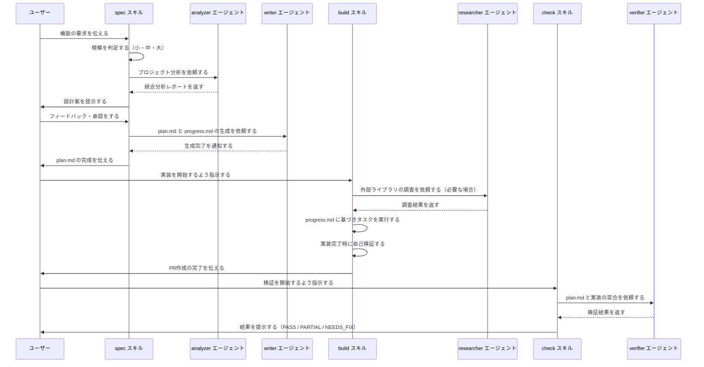
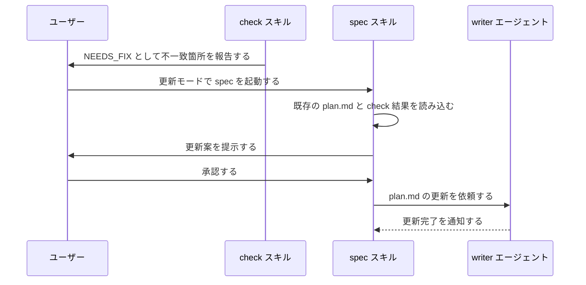
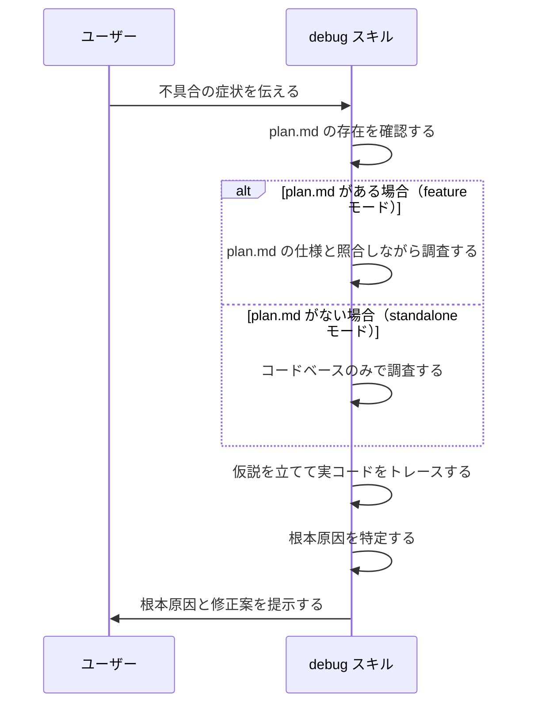
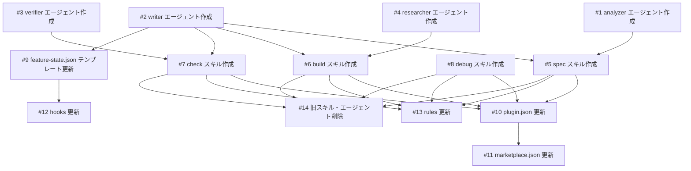

# spec-flow スペックループ再設計

## 概要

spec-flow プラグインを利用する開発者が、仕様作成・実装・検証のサイクルを途切れなく回し続けられるようにする。現在の線形パイプライン（plan → strategy → implement → verify + troubleshoot）は、仕様と実装のズレが生じた際に手動で前のステップに戻る必要があり、ループが閉じていない。スキル数を5→4、エージェント数を9→4に削減しながら、spec ↔ build ↔ check の循環ワークフローを実現し、plan品質の向上・初回体験の簡素化・出力品質の安定性を達成する。

## 受入条件

- [ ] AC-1: spec スキルが新規モード（plan.md 生成）と更新モード（plan.md 更新）の2モードで動作する
- [ ] AC-2: spec スキルに strategy の機能（PR分割・デリバリー順序）が統合されている
- [ ] AC-3: build スキルが plan.md + progress.md に基づいて実装を進め、仕様漏れ検出時に spec への差し戻しを促す
- [ ] AC-4: check スキルが plan.md と実装コードを突合し、PASS / PARTIAL / NEEDS_FIX の3段階で判定する
- [ ] AC-5: check の NEEDS_FIX 結果を spec の更新モードで読み込み、plan.md を更新できる（ループ成立）
- [ ] AC-6: debug スキルが feature モード / standalone モードの2モードで独立動作する
- [ ] AC-7: analyzer エージェントがプロジェクトのコンテキスト・コードパターン・Git履歴を統合的に分析する（3エージェント分の機能を1つで）
- [ ] AC-8: writer エージェントが plan.md / progress.md / result.md を生成し、生成時に自己検証を含む（3エージェント分の機能を1つで）
- [ ] AC-9: verifier エージェントが plan.md と実装コードの突合検証を行う
- [ ] AC-10: researcher エージェントが外部ライブラリの調査を行う
- [ ] AC-11: feature-state.json が各フェーズの独立ステータス管理で、ループ（done → in_progress への戻り）に対応する
- [ ] AC-12: feature-state-manager エージェントが廃止され、スキル内でインライン処理される
- [ ] AC-13: plugin.json が新しいスキル・エージェント構成で更新されている
- [ ] AC-14: hooks（skill-reminder.sh）が新しいフェーズ構成に対応している
- [ ] AC-15: .claude/rules/ が新しい構造に合わせて更新されている

## スコープ

### やること

- 全スキルの再設計・実装（spec, build, check, debug）
- 全エージェントの再設計・実装（analyzer, writer, verifier, researcher）
- plugin.json の更新
- hooks の更新
- .claude/rules/ の更新
- 旧スキル・エージェントの削除
- feature-state.json テンプレートの更新
- marketplace.json の更新

### やらないこと

- 評価フレームワークの再設計（別機能として後で対応）
- README.md の更新（実装完了後に別途対応）
- 既存の docs/plans/ 配下のデータ移行（存在しないため不要）

## 非機能要件

- ランタイムコードなし。全ての挙動は Markdown プロンプト + JSON 設定 + Bash フックで実現する
- 新規ユーザーが /spec → /build → /check の順で実行するだけでループを体験できる（初回体験の簡素化）
- スキル・エージェントの命名は英語で、直感的・国際的に通用する語を選ぶ

## データフロー

### メインフロー（新規機能）



### ループフロー（仕様更新）



### debug フロー（不具合調査）



## スキル設計

### spec スキル（plan + strategy を統合）

spec スキルは、ユーザーの要求から plan.md を生成するスキルである。既存の plan.md がある場合は更新モードに切り替える。

**新規モード**: plan.md が存在しない場合に動作する。ヒアリング → analyzer による統合分析 → 設計対話 → writer による生成 の順で進む。受入条件数・変更ファイル数により規模を判定し（小: タスク3未満 / 中: 3-7 / 大: 8以上）、大規模の場合は PR 分割付きの progress.md も同時生成する。これにより strategy スキルの機能を統合する。

**更新モード**: plan.md が既に存在する場合に動作する。既存の plan.md と check 結果またはユーザーの追加要求を読み込み、変更点をヒアリングした上で writer に更新を依頼する。このモードにより check → spec のループが成立する。

### build スキル（implement の後継）

plan.md に基づいて実装を進め、PR を作成するスキルである。progress.md のタスク完了状態で中断・再開を管理する。実装中に plan.md にない要件が発生した場合は仕様漏れとして検出し、spec への差し戻しを促す。外部ライブラリの調査が必要な場合は researcher エージェントに委譲する。

### check スキル（verify の後継）

plan.md と実装コードの突合検証を行うスキルである。plan.md の受入条件を抽出し、verifier エージェントに突合を依頼する。結果を PASS（全条件充足）/ PARTIAL（軽微な不一致あり）/ NEEDS_FIX（重大な不一致あり）の3段階で判定し提示する。NEEDS_FIX の場合は不一致箇所を具体的に列挙し、spec での更新または build での修正を提案する。検証結果は writer エージェントが result.md として生成する。

### debug スキル（troubleshoot の後継）

不具合の根本原因を調査するスキルである。推測による修正を禁止し、仮説立案と検証のサイクルで根本原因を特定してから修正案を提示する。plan.md が存在する機能の不具合を調査する feature モードと、plan.md なしで独立して調査する standalone モードの2モードを持つ。

## エージェント設計

### analyzer エージェント（context-collector + code-researcher + git-analyzer を統合）

プロジェクトの統合分析を担当するエージェントである。コンテキスト・コードパターン・Git履歴を一体的に理解し、「断片的な3レポート」ではなく「プロジェクトの全体像 + この機能に関する洞察」を1つの統合レポートで返す。model は opus を使用する。使用ツールは Read, Glob, Grep, Bash。

### writer エージェント（spec-writer + spec-reviewer + strategy-writer を統合）

plan.md / progress.md / result.md の生成・更新を担当するエージェントである。生成時に自己検証を含む（書いてからチェックではなく、正しく書く）。フォーマット定義は `agents/writer/references/formats/` 配下に、テンプレートガイドは `agents/writer/references/templates/` 配下に配置する。model は sonnet を使用する。使用ツールは Read, Write, Edit, Glob。

### verifier エージェント（implementation-verifier の後継）

plan.md と実装コードの突合検証を担当するエージェントである。受入条件ごとに検証結果を報告する。model は opus を使用する。使用ツールは Read, Glob, Grep。

### researcher エージェント（library-researcher の後継）

外部ライブラリの実装に必要な情報を調査するエージェントである。model は sonnet を使用する。使用ツールは Read, Glob, Grep, WebSearch, WebFetch, Bash。

## 状態管理

feature-state.json を簡素化する。各フェーズ（spec / build / check）を独立したステータスで管理する。ステータスは pending / in_progress / done の3値を持ち、done → in_progress への戻りに対応することでループを実現する。feature-state-manager エージェントは廃止し、各スキル内でインライン処理する。

feature-state.json のデータ構造は、機能名・spec フェーズ（ステータス・更新日時・参照ドキュメント一覧）・build フェーズ（同上）・check フェーズ（同上）・debug フェーズ（参照ドキュメント一覧）・全体の更新日時で構成する。

### feature-state.json の更新責務

phase フィールドは現在アクティブなフェーズ（spec / build / check / done）を示す。各スキルが開始時・完了時に更新する。

- **spec スキル**: 開始時に phase を "spec"、spec.status を "in_progress" に設定する。完了時に spec.status を "done"、phase を "build" に設定する
- **build スキル**: 開始時に phase を "build"、build.status を "in_progress" に設定する。完了時に build.status を "done"、phase を "check" に設定する
- **check スキル**: 開始時に phase を "check"、check.status を "in_progress" に設定する。PASS 時に check.status を "done"、phase を "done" に設定する。NEEDS_FIX 時は phase を "spec" に戻し、spec.status を "in_progress" に戻す
- **debug スキル**: phase は変更しない。debug.references に調査レポートパスを追加するのみ

## hooks

- **hooks.json**: 変更不要。イベント構成（UserPromptSubmit, PostToolUse）は現行と同じ
- **skill-reminder.sh**: 変更が必要。現行は `"phase".*"done"` で完了判定しており、新しい feature-state.json でも phase フィールドを維持するため、判定ロジック自体は変更不要。ただし新しいフェーズ名（spec / build / check / done）に対応していることを確認する

## 設計判断

| 判断事項 | 選択 | 理由 | 検討した代替案 |
|---------|------|------|--------------|
| strategy を独立スキルとして残すか | spec に統合する | PR分割は設計の一部であり、別コマンドにするとユーザーの手順が増える | 独立スキルとして残す → ユーザーの手間が増える |
| verify を独立スキルとして残すか | check として残す | 検証は任意のタイミングで実行したい。build 内蔵だと強制される | build に内蔵する → 柔軟性が下がる |
| 3調査エージェントを統合するか | 1つの analyzer に統合する | 断片的な3レポートより統合レポートの方が plan 品質に貢献する | 並列実行で速度を優先する → 情報の断片化が課題 |
| feature-state-manager を残すか | 廃止してインライン化する | JSON 更新のためだけにエージェントを起動するのは過剰である | 残す → 不要な複雑さが増す |
| スキル名を変えるか | spec / build / check / debug に変更する | 直感的で覚えやすく、国際的に通用する | plan / implement / verify / troubleshoot → 長く冗長 |

## システム影響

### 影響範囲

- 全スキル（5ファイル削除: plan, strategy, implement, verify, troubleshoot。4ファイル新規作成: spec, build, check, debug）
- 全エージェント（9ディレクトリ削除: context-collector, code-researcher, git-analyzer, spec-writer, spec-reviewer, strategy-writer, implementation-verifier, library-researcher, feature-state-manager。4ディレクトリ新規作成: analyzer, writer, verifier, researcher）
- plugin.json（スキル・エージェント一覧の全面書き換え）
- marketplace.json（説明文の更新）
- hooks/skill-reminder.sh（新しいフェーズ構成への対応）
- .claude/rules/（plugin-structure.md, agent-authoring.md, skill-authoring.md の3ファイルを更新）
- feature-state-manager のテンプレート → `agents/writer/references/` に移動
- verify のテンプレート（`skills/verify/templates/result.md`）→ `agents/writer/references/` に移動

### リスク

- 既存ユーザーのコマンド習慣が変わる（/plan → /spec, /implement → /build, /verify → /check, /troubleshoot → /debug）。旧コマンドは削除されるため移行が必要
- テンプレートのセクション構造を変更した場合、後続スキルが依存しているため一貫性の確認が必要

## 実装タスク

### 依存関係図



### タスク一覧

| # | タスク | 対象ファイル | 見積 | 依存 |
|---|--------|-------------|------|------|
| 1 | analyzer エージェント作成 | `agents/analyzer/analyzer.md`, `agents/analyzer/references/formats/output.md` | M | - |
| 2 | writer エージェント作成 | `agents/writer/writer.md`, `agents/writer/references/formats/plan.md`, `agents/writer/references/formats/progress.md`, `agents/writer/references/formats/result.md`, `agents/writer/references/templates/` | L | - |
| 3 | verifier エージェント作成 | `agents/verifier/verifier.md`, `agents/verifier/references/formats/output.md` | S | - |
| 4 | researcher エージェント作成 | `agents/researcher/researcher.md`, `agents/researcher/references/formats/output.md` | S | - |
| 5 | spec スキル作成 | `skills/spec/SKILL.md` | L | #1, #2 |
| 6 | build スキル作成 | `skills/build/SKILL.md` | L | #2, #4 |
| 7 | check スキル作成 | `skills/check/SKILL.md` | M | #2, #3 |
| 8 | debug スキル作成 | `skills/debug/SKILL.md` | M | - |
| 9 | feature-state.json テンプレート更新 | `agents/writer/references/templates/feature-state.json` | S | #2 |
| 10 | plugin.json 更新 | `.claude-plugin/plugin.json` | S | #1〜#8 |
| 11 | marketplace.json 更新 | `.claude-plugin/marketplace.json` | S | #10 |
| 12 | hooks 更新 | `hooks/skill-reminder.sh`（hooks.json は変更不要） | S | #9 |
| 13 | rules 更新 | `.claude/rules/plugin-structure.md`, `.claude/rules/agent-authoring.md`, `.claude/rules/skill-authoring.md` | M | #1〜#8 |
| 14 | 旧スキル・エージェント削除 | `skills/plan/`, `skills/strategy/`, `skills/implement/`, `skills/verify/`, `skills/troubleshoot/`, `agents/context-collector/`, `agents/code-researcher/`, `agents/git-analyzer/`, `agents/spec-writer/`, `agents/spec-reviewer/`, `agents/strategy-writer/`, `agents/implementation-verifier/`, `agents/library-researcher/`, `agents/feature-state-manager/` | S | #5〜#8 |

> 見積基準: S(〜1h), M(1-3h), L(3h〜)

## テスト方針

### トレーサビリティ

| 受入条件 | 自動テスト | 手動検証 |
|---------|-----------|---------|
| AC-1: spec 新規/更新モード | 評価シナリオ #1 | MV-1, MV-2 |
| AC-2: spec に strategy 統合 | 評価シナリオ #2 | MV-3 |
| AC-3: build の仕様漏れ検出 | 評価シナリオ #3 | MV-4 |
| AC-4: check の3段階判定 | 評価シナリオ #4 | MV-5 |
| AC-5: ループ成立 | 評価シナリオ #5 | MV-6 |
| AC-6: debug の2モード | 評価シナリオ #6 | MV-7 |
| AC-7: analyzer 統合分析 | 評価シナリオ #7 | - |
| AC-8: writer 自己検証 | 評価シナリオ #8 | - |
| AC-9: verifier 突合検証 | 評価シナリオ #9 | - |
| AC-10: researcher 調査 | 評価シナリオ #10 | - |
| AC-11: feature-state ループ対応 | 評価シナリオ #11 | MV-8 |
| AC-12: feature-state-manager 廃止 | 評価シナリオ #12 | - |
| AC-13: plugin.json 更新 | - | MV-9 |
| AC-14: hooks 更新 | - | MV-11 |
| AC-15: rules 更新 | - | MV-12 |

### 自動テスト

| # | テスト | 種別 | 対象 |
|---|--------|------|------|
| 1 | plan.md 未存在時に新規モード、存在時に更新モードで動作することを確認 | 評価 | `skills/spec/SKILL.md` |
| 2 | 大規模機能で PR分割付き progress.md が生成されることを確認 | 評価 | `skills/spec/SKILL.md` |
| 3 | plan.md にない要件発生時に spec 差し戻しが促されることを確認 | 評価 | `skills/build/SKILL.md` |
| 4 | 完全一致→PASS、軽微不一致→PARTIAL、重大不一致→NEEDS_FIX の判定を確認 | 評価 | `skills/check/SKILL.md` |
| 5 | check の NEEDS_FIX → spec 更新モード → plan.md 更新の一連フローを確認 | 評価 | `skills/check/SKILL.md`, `skills/spec/SKILL.md` |
| 6 | plan.md 有無で feature/standalone モードが切り替わることを確認 | 評価 | `skills/debug/SKILL.md` |
| 7 | 1つのレポートにコンテキスト・パターン・履歴が統合されていることを確認 | 評価 | `agents/analyzer/analyzer.md` |
| 8 | 生成された plan.md にセクション間の矛盾がないことを確認 | 評価 | `agents/writer/writer.md` |
| 9 | 現行の implementation-verifier と同等の突合品質を確認 | 評価 | `agents/verifier/verifier.md` |
| 10 | 現行の library-researcher と同等の調査品質を確認 | 評価 | `agents/researcher/researcher.md` |
| 11 | done → in_progress への遷移が正しく動作することを確認 | 評価 | `skills/spec/SKILL.md`, `skills/build/SKILL.md` |
| 12 | スキル内で feature-state.json が正しく更新されることを確認 | 評価 | `skills/spec/SKILL.md`, `skills/build/SKILL.md`, `skills/check/SKILL.md` |

### ビルド確認

```bash
# プラグインが正常にインストールされること
/plugin install

# 各スキルが起動すること
/spec
/build
/check
/debug

# hooks が正しく動作すること（ファイル変更時に skill-reminder.sh が実行されること）
```

### 手動検証チェックリスト

- [ ] MV-1: /spec で新規 plan.md が生成される
- [ ] MV-2: /spec で既存 plan.md が更新される（更新モード）
- [ ] MV-3: /spec で大規模機能を指定すると PR分割付き progress.md が生成される
- [ ] MV-4: /build で plan.md にない要件が検出された場合に spec への差し戻しが促される
- [ ] MV-5: /check で検証結果が PASS / PARTIAL / NEEDS_FIX の3段階で判定される
- [ ] MV-6: /check → /spec → /build のループが成立する
- [ ] MV-7: /debug が feature / standalone 両モードで動作する
- [ ] MV-8: feature-state.json のループ（done → in_progress）が動作する
- [ ] MV-9: plugin.json に新しい4スキル・4エージェントが定義され、旧定義が削除されている
- [ ] MV-10: 旧スキル・エージェントのファイルが完全に削除されている
- [ ] MV-11: hooks が新しいフェーズ構成（spec / build / check）に対応している
- [ ] MV-12: .claude/rules/ の3ファイルが新しい構造と整合している
