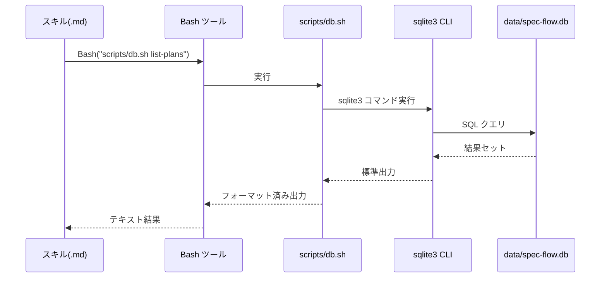
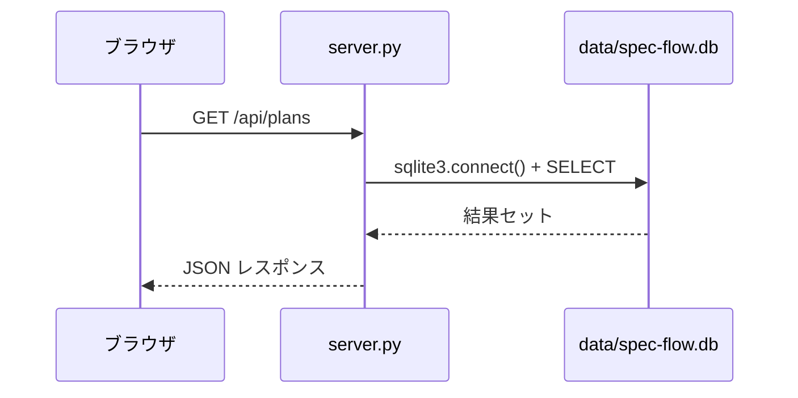
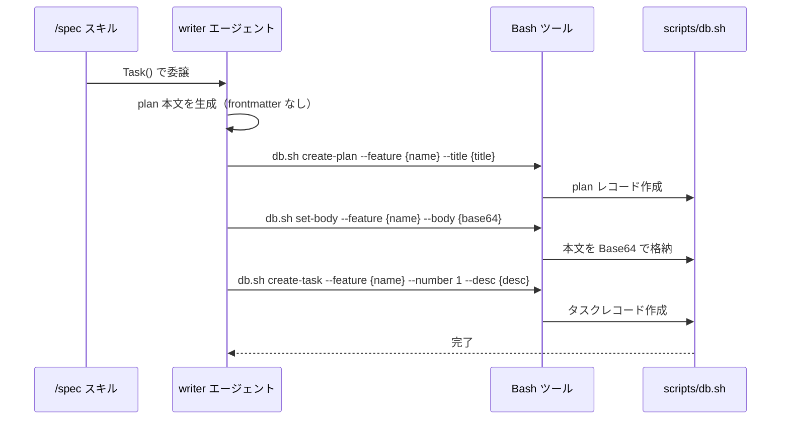
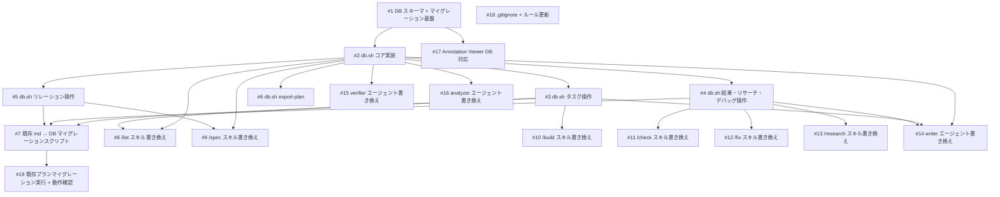

# プラン管理の SQLite DB フル移行

## 概要

現在の md ファイルベースのプラン管理（plan.md, progress.md, result.md, research-*.md, debug-*.md）を SQLite DB にフル移行する。Bash ヘルパースクリプト（`scripts/db.sh`）と sqlite3 CLI で DB を操作し、各スキルは直接 md ファイルを Read/Write する代わりに `db.sh` 経由で DB を操作する。Annotation Viewer（`server.py`）も DB を直接読み取るように改修する。

## 確認事項

| # | 項目 | 根拠 | ステータス |
|---|------|------|-----------|
| 1 | plan.md 本文の格納方式 | Base64 エンコードで DB に格納。`db.sh get-body` でデコード取得可能 | 確認済み |
| 2 | Annotation Viewer の対応方式 | `server.py` を Python sqlite3 モジュールによる DB 直接読み取りに改修 | 確認済み |
| 3 | Git 差分の喪失への対応 | DB はバイナリのため git diff 不可。必要時は `db.sh export-plan` で md に書き出してコミット | 確認済み |
| 4 | 既存 19 プランのマイグレーション | `migrate-md-to-db.sh` で一括インポート。失敗時は md ファイルが残っているのでロールバック可能 | 確認済み |
| 5 | 同時実行の制御 | WAL モード + busy_timeout=5000 で対応 | 確認済み |
| 6 | ファイルベース推論からの移行 | `.claude/rules/plugin-structure.md` はプロジェクトのフェーズ管理ルールを定義するファイル。現在「state.json は使わない。plan.md + progress.md の存在でフェーズを推論する」と記載されている。DB 移行後はファイル存在ではなく DB レコードの存在でフェーズを推論するため、このルールを DB ベースに更新する必要がある | 確認済み |

## 追加検討事項

| # | 観点 | 詳細 | 根拠 |
|---|------|------|------|
| 1 | writer エージェントの frontmatter 処理 | frontmatter は DB カラムに分解格納し、本文のみ Base64 で body カラムに格納。writer は frontmatter なしの Markdown 本文を生成し、メタデータは `db.sh` のパラメータとして渡す | `agents/writer/writer.md` |
| 2 | /list のステータス算出ロジック移行 | `db.sh list-plans` の出力に status カラム・tasks 集計結果・results の judgment を JOIN して返す。ステータス算出ロジックは SQL クエリ内に移動 | `skills/list/SKILL.md` |
| 3 | allowed-tools の変更 | Read/Glob のみだったスキル（/list 等）に Bash を追加する必要がある | 各 `SKILL.md` の allowed-tools 行 |
| 4 | プラグイン配布時の DB 初期化 | `db.sh migrate` を各スキルの冒頭で暗黙的に実行し、DB がなければ自動作成する仕組み | 初回利用時のエラー防止 |

## 関連プラン

| プラン | 関連 |
|--------|------|
| [annotation-cycle](../annotation-cycle/plan.md) | Annotation Viewer のファイル読み取りパターンが DB 直接読み取りに変更される |
| [list-skill](../list-skill/plan.md) | /list のステータス算出ロジックが全面的に DB ベースに変更される |
| [related-plan-linking](../related-plan-linking/plan.md) | リレーション管理が DB の plan_relations テーブルに移行される |
| [dev-flow-improvements](../dev-flow-improvements/plan.md) | result.md の judgment フィールドが DB の results テーブルに移行される |

## スコープ

### やること

- SQLite DB スキーマ設計とマイグレーション基盤の構築
- `scripts/db.sh` ヘルパースクリプトの新規作成（全サブコマンド）
- 全 6 スキル（list, spec, build, check, fix, research）の DB 移行
- writer / verifier / analyzer エージェントの DB 移行
- Annotation Viewer（`server.py`）の DB 直接読み取り対応
- 既存 19 プランの md -> DB マイグレーションスクリプトと実行
- `.gitignore` と `.claude/rules/plugin-structure.md` の更新

### やらないこと

- MCP サーバー型のアーキテクチャ（トークン消費増のため不採用）
- md ファイルとの同期（ハイブリッド方式は不採用。フル移行）
- 自動テスト（BATS 等は別タスクで対応）
- DB 内容のブラウザ閲覧用 Web UI（別タスクで検討）

## 受入条件

- [ ] AC-1: `scripts/db.sh` が存在し、plan の CRUD 操作（create-plan, get-plan, list-plans, update-plan）ができる
- [ ] AC-2: `db.sh` の本文操作（get-body, set-body）で Base64 エンコード/デコードによる Markdown 本文の読み書きができる
- [ ] AC-3: `db.sh` のタスク操作（create-task, update-task-status, list-tasks）でタスク進捗を管理できる
- [ ] AC-4: `db.sh` の結果・リサーチ・デバッグ操作（create-result, get-result, create-research, list-research, get-research-body, create-debug, list-debug）ができる
- [ ] AC-5: `db.sh` のリレーション操作（add-relation, get-relations）でプラン間の関連を管理できる
- [ ] AC-6: `db.sh export-plan` で DB の内容を md ファイルに書き出し、Git コミットに使える
- [ ] AC-7: `db.sh migrate` が初回実行時に DB を自動作成し、スキーマを最新にマイグレートする
- [ ] AC-8: 全 6 スキル（/list, /spec, /build, /check, /fix, /research）が `db.sh` 経由でデータを取得・更新する
- [ ] AC-9: writer エージェントが plan / progress / result の生成を `db.sh` 経由で DB に書き込む
- [ ] AC-10: verifier エージェントが `db.sh get-body` で plan 本文を取得する
- [ ] AC-11: Annotation Viewer（`server.py`）が SQLite から直接 plan 本文を読み取り、ブラウザに表示する
- [ ] AC-12: 既存 19 プランのマイグレーションスクリプト（`scripts/migrate-md-to-db.sh`）が存在し、全プランを DB にインポートできる
- [ ] AC-13: DB ファイル（`data/*.db`, `data/*.db-wal`, `data/*.db-shm`）が `.gitignore` に追加されている
- [ ] AC-14: スキーマ定義 SQL（`migrations/`）と `scripts/db.sh` がバージョン管理されている

## 非機能要件

- 同時実行制御: WAL モード + busy_timeout=5000ms で sqlite3 の同時アクセスに対応
- DB 自動初期化: 各スキル実行時に DB が存在しなければ `db.sh migrate` で自動作成
- データ安全性: 既存 md ファイルはマイグレーション後も残存し、ロールバック可能

## データフロー

### メインフロー: スキルから DB への CRUD 操作



### Annotation Viewer フロー



### writer エージェントの DB 書き込みフロー



## DB 変更

### データモデル

#### plans テーブル

- 目的: プラン（機能仕様）のメタデータと本文を管理する
- 関係: tasks, plan_relations, results, research, debug_logs の親テーブル

| カラム | 型 | 制約 | デフォルト |
|--------|------|------|-----------|
| id | INTEGER | PK, AUTOINCREMENT | - |
| feature_name | TEXT | UNIQUE, NOT NULL | - |
| title | TEXT | NOT NULL | - |
| status | TEXT | NOT NULL | 'draft' |
| body | TEXT | - | NULL |
| created_at | TEXT | - | datetime('now') |
| updated_at | TEXT | - | datetime('now') |

- status の値: draft / in_progress / done

#### tasks テーブル

- 目的: プランに紐づく実装タスクの進捗を管理する
- 関係: plans テーブルと多対1（plan_id で参照、CASCADE 削除）

| カラム | 型 | 制約 | デフォルト |
|--------|------|------|-----------|
| id | INTEGER | PK, AUTOINCREMENT | - |
| plan_id | INTEGER | FK(plans.id) ON DELETE CASCADE, NOT NULL | - |
| task_number | INTEGER | NOT NULL | - |
| description | TEXT | NOT NULL | - |
| status | TEXT | NOT NULL | 'pending' |

- UNIQUE 制約: (plan_id, task_number)
- status の値: pending / in_progress / done

#### plan_relations テーブル

- 目的: プラン間の関連（依存・競合等）を管理する
- 関係: plans テーブルと多対多（source_plan_id, target_plan_id で参照、CASCADE 削除）

| カラム | 型 | 制約 | デフォルト |
|--------|------|------|-----------|
| id | INTEGER | PK, AUTOINCREMENT | - |
| source_plan_id | INTEGER | FK(plans.id) ON DELETE CASCADE, NOT NULL | - |
| target_plan_id | INTEGER | FK(plans.id) ON DELETE CASCADE, NOT NULL | - |
| relation_type | TEXT | NOT NULL | 'related' |
| description | TEXT | - | NULL |

- UNIQUE 制約: (source_plan_id, target_plan_id)
- relation_type の値: related / depends_on / conflicts

#### results テーブル

- 目的: プランの検証結果（judgment）と本文を管理する
- 関係: plans テーブルと多対1（plan_id で参照、CASCADE 削除）。check を複数回実行した履歴を保持できる（plan_id に対して複数レコード可能）

| カラム | 型 | 制約 | デフォルト |
|--------|------|------|-----------|
| id | INTEGER | PK, AUTOINCREMENT | - |
| plan_id | INTEGER | FK(plans.id) ON DELETE CASCADE, NOT NULL | - |
| judgment | TEXT | NOT NULL | - |
| body | TEXT | - | NULL |
| created_at | TEXT | - | datetime('now') |

- judgment の値: PASS / PARTIAL / NEEDS_FIX

#### research テーブル

- 目的: リサーチ結果のトピックと本文を管理する
- 関係: plans テーブルと多対1（plan_id で参照、SET NULL 削除）。plan_id は NULL 許容（プラン未紐付けのリサーチ）

| カラム | 型 | 制約 | デフォルト |
|--------|------|------|-----------|
| id | INTEGER | PK, AUTOINCREMENT | - |
| plan_id | INTEGER | FK(plans.id) ON DELETE SET NULL | NULL |
| topic | TEXT | NOT NULL | - |
| research_type | TEXT | - | NULL |
| body | TEXT | - | NULL |
| created_at | TEXT | - | datetime('now') |

- research_type の値: codebase / external / combined

#### debug_logs テーブル

- 目的: デバッグログの本文を管理する
- 関係: plans テーブルと多対1（plan_id で参照、SET NULL 削除）。plan_id は NULL 許容

| カラム | 型 | 制約 | デフォルト |
|--------|------|------|-----------|
| id | INTEGER | PK, AUTOINCREMENT | - |
| plan_id | INTEGER | FK(plans.id) ON DELETE SET NULL | NULL |
| body | TEXT | - | NULL |
| created_at | TEXT | - | datetime('now') |

### 対象ファイル

- 新規: `migrations/0001_initial_schema.sql` -- 全テーブルの CREATE TABLE 文

## バックエンド変更

### API 設計

`scripts/db.sh` のサブコマンドが CLI API として機能する。

| サブコマンド | 説明 | 入力 | 出力 |
|-------------|------|------|------|
| `migrate` | スキーママイグレーション実行 | - | 実行結果メッセージ |
| `create-plan` | プラン作成 | `--feature`, `--title` | 作成された plan の id |
| `get-plan` | プラン取得 | `--feature` | TSV 形式のプラン情報 |
| `list-plans` | プラン一覧 | - | TSV 形式の全プラン一覧（tasks 集計・judgment 含む） |
| `update-plan` | プラン更新 | `--feature`, `--status` | 更新結果メッセージ |
| `get-body` | 本文取得 | `--feature` | デコード済み Markdown 本文 |
| `set-body` | 本文設定 | `--feature`, stdin から本文 | 設定結果メッセージ |
| `create-task` | タスク作成 | `--feature`, `--number`, `--desc` | 作成された task の id |
| `update-task-status` | タスク状態更新 | `--feature`, `--number`, `--status` | 更新結果メッセージ |
| `list-tasks` | タスク一覧 | `--feature` | TSV 形式のタスク一覧 |
| `create-result` | 結果作成 | `--feature`, `--judgment`, stdin から本文 | 作成された result の id |
| `get-result` | 結果取得 | `--feature` | judgment + デコード済み本文 |
| `create-research` | リサーチ作成 | `--feature`(任意), `--topic`, `--type`(任意), stdin から本文 | 作成された research の id |
| `list-research` | リサーチ一覧 | `--feature`(任意) | TSV 形式のリサーチ一覧 |
| `get-research-body` | リサーチ本文取得 | `--id` | デコード済み Markdown 本文 |
| `create-debug` | デバッグログ作成 | `--feature`(任意), stdin から本文 | 作成された debug_log の id |
| `list-debug` | デバッグログ一覧 | `--feature`(任意) | TSV 形式のデバッグログ一覧 |
| `add-relation` | リレーション追加 | `--source`, `--target`, `--type`(任意), `--desc`(任意) | 作成された relation の id |
| `get-relations` | リレーション取得 | `--feature` | TSV 形式の関連プラン一覧 |
| `export-plan` | md ファイル書き出し | `--feature`, `--output`(任意) | 書き出し先パス |

- 主要なエラーケース:
  - 存在しない feature_name を指定 -> エラーメッセージ + 終了コード 1
  - 重複する feature_name で create-plan -> エラーメッセージ + 終了コード 1
  - DB ファイルが存在しない場合 -> 自動で `migrate` を実行

### 対象ファイル

- 新規: `scripts/db.sh` -- DB 操作ヘルパースクリプト
- 新規: `scripts/migrate-md-to-db.sh` -- 既存 md -> DB マイグレーションスクリプト

## フロントエンド変更

### 画面・UI 設計

- Annotation Viewer（`server.py` + `viewer.html`）のデータソースをファイルシステムから SQLite DB に変更
- 画面レイアウト自体は変更なし（データ取得層のみ改修）
- plan 本文は DB から Base64 デコードして返却

### 対象ファイル

- 変更: `scripts/annotation-viewer/server.py` -- ファイル読み取りから SQLite 直接読み取りに変更

## 設計判断

| 判断事項 | 選択 | 理由 | 検討した代替案 |
|---------|------|------|--------------|
| DB 操作方式 | Bash スクリプト + sqlite3 CLI | Claude Code の Bash ツールから直接呼び出せる。MCP サーバー不要でトークン消費を抑制 | MCP サーバー型 -- トークン消費増のため不採用 |
| 本文格納方式 | Base64 エンコード | Markdown 本文にシングルクォート等の特殊文字が含まれるため、SQL インジェクション回避とデータ整合性を保証 | そのまま TEXT 格納 -- エスケープ処理が複雑 |
| 移行方式 | フル移行（md 廃止） | ハイブリッド方式は同期の複雑性が高い。単一データソースでシンプルに | ハイブリッド方式（md + DB 同期）-- 同期ロジックの複雑性が高く不採用 |
| Git 差分への対応 | export-plan サブコマンド | 必要時のみ md に書き出してコミット。通常運用では DB のみ | DB 内容を JSON で git 管理 -- 差分が見づらい |
| Annotation Viewer の DB アクセス | Python sqlite3 モジュール直接 | server.py は Python で記述済み。sqlite3 は標準ライブラリで追加依存なし | db.sh 経由 -- サブプロセス呼び出しのオーバーヘッド |

## システム影響

### 影響範囲

- 全 6 スキル（list, spec, build, check, fix, research）のデータ入出力方式が変更
- writer / verifier / analyzer エージェントのデータ入出力方式が変更
- Annotation Viewer のデータソースが変更
- `.claude/rules/plugin-structure.md` のフェーズ管理ルールが DB ベースに変更
- 各スキルの allowed-tools に Bash が追加される

### リスク

- 全スキル・エージェントを同時に改修するため、移行中の中間状態で動作しない期間が発生する -> PR 分割で段階的に移行
- sqlite3 CLI がインストールされていない環境では動作しない -> macOS/Linux では標準搭載
- DB ファイルの破損リスク -> WAL モードと定期的な export-plan での md バックアップで対応

### エッジケース

| # | ケース | 影響 | 対応方針 |
|---|--------|------|---------|
| 1 | DB ファイルが破損した場合 | 全プランデータにアクセス不能 | `PRAGMA integrity_check` でチェック。破損時は DB ファイルを削除し `migrate` で再作成後、`migrate-md-to-db.sh`（md バックアップが残っていれば）で復旧。定期的に `export-plan` で md をエクスポートしておくことを推奨 |
| 2 | マイグレーション中のエラー（md パース失敗、Base64 エンコード失敗） | 一部プランがインポートされない | `migrate-md-to-db.sh` は失敗プランをスキップしてログ出力。処理終了後に失敗一覧を表示し、手動対応を促す |
| 3 | 0 件のプランがある状態での `/list` 実行 | 空の結果表示 | `db.sh list-plans` は空の結果セットを返す。スキル側で「プランがありません」メッセージを表示 |
| 4 | `feature_name` に特殊文字（スペース、日本語、記号）が含まれる場合 | SQL エラーまたは予期しない動作 | `db.sh` で `feature_name` のバリデーション（`[a-z0-9-]` のみ許可）を実施。不正な場合はエラーメッセージ + 終了コード 1 |
| 5 | 極端に大きい plan 本文（数百 KB）の Base64 エンコード/デコード | コマンドライン引数の長さ制限超過、パフォーマンス低下 | 本文は stdin/stdout 経由で受け渡し（コマンドライン引数には含めない）。`set-body` は stdin から読み取り、`get-body` は stdout に出力 |
| 6 | `db.sh` の同時実行（2つの Claude セッションから同時に `update-task-status`） | データ競合、SQLITE_BUSY エラー | WAL モード + `busy_timeout=5000` で自動リトライ。5秒以内にロック取得できなければエラー終了 |
| 7 | WAL モードの `-wal` / `-shm` ファイルの扱い | これらのファイルが git に含まれると問題 | `.gitignore` に `data/*.db-wal` と `data/*.db-shm` も追加する |

## 実装タスク

### 依存関係図



### タスク一覧

| # | タスク | 対象ファイル | 見積 | 依存 |
|---|--------|------------|------|------|
| 1 | DB スキーマ設計 + マイグレーション基盤 | `migrations/0001_initial_schema.sql`, `scripts/db.sh`(migrate サブコマンド) | M | - |
| 2 | db.sh コア実装（plan CRUD + body 操作） | `scripts/db.sh` | L | #1 |
| 3 | db.sh タスク操作 | `scripts/db.sh` | M | #2 |
| 4 | db.sh 結果・リサーチ・デバッグ操作 | `scripts/db.sh` | M | #2 |
| 5 | db.sh リレーション操作 | `scripts/db.sh` | S | #2 |
| 6 | db.sh export-plan | `scripts/db.sh` | M | #2 |
| 7 | 既存 md -> DB マイグレーションスクリプト | `scripts/migrate-md-to-db.sh` | L | #1, #2, #3, #4, #5 |
| 8 | /list スキル書き換え | `skills/list/SKILL.md` | M | #2, #3 |
| 9 | /spec スキル書き換え | `skills/spec/SKILL.md` | M | #2, #5 |
| 10 | /build スキル書き換え | `skills/build/SKILL.md` | M | #3 |
| 11 | /check スキル書き換え | `skills/check/SKILL.md` | S | #4 |
| 12 | /fix スキル書き換え | `skills/fix/SKILL.md` | S | #4 |
| 13 | /research スキル書き換え | `skills/research/SKILL.md` | S | #4 |
| 14 | writer エージェント書き換え | `agents/writer/writer.md`, `agents/writer/references/formats/plan.md`, `agents/writer/references/formats/progress.md`, `agents/writer/references/formats/result.md` | L | #2, #3, #4 |
| 15 | verifier エージェント書き換え | `agents/verifier/verifier.md` | S | #2 |
| 16 | analyzer エージェント書き換え | `agents/analyzer/analyzer.md` | S | #2 |
| 17 | Annotation Viewer DB 対応 | `scripts/annotation-viewer/server.py` | M | #1 |
| 18 | .gitignore + ルール更新 | `.gitignore`, `.claude/rules/plugin-structure.md` | S | - |
| 19 | 既存 19 プランのマイグレーション実行 + 動作確認 | - | M | #7 |

> 見積基準: S(~1h), M(1-3h), L(3h~)

## テスト方針

### トレーサビリティ

| 受入条件 | 自動テスト | 手動検証 |
|---------|-----------|---------|
| AC-1 | - | MV-1 |
| AC-2 | - | MV-2 |
| AC-3 | - | MV-3 |
| AC-4 | - | MV-4 |
| AC-5 | - | MV-5 |
| AC-6 | - | MV-6 |
| AC-7 | - | MV-7 |
| AC-8 | - | MV-8 |
| AC-9 | - | MV-9 |
| AC-10 | - | MV-10 |
| AC-11 | - | MV-11 |
| AC-12 | - | MV-12 |
| AC-13 | - | MV-13 |
| AC-14 | - | MV-13 |

### 自動テスト

自動テスト（BATS 等）はスコープ外。全て手動検証で対応する。

### ビルド確認

```bash
# db.sh の構文チェック
bash -n scripts/db.sh

# migrate-md-to-db.sh の構文チェック
bash -n scripts/migrate-md-to-db.sh
```

### 手動検証チェックリスト

- [ ] MV-1: `db.sh create-plan --feature test --title "テスト"` でプランが作成され、`db.sh get-plan --feature test` で取得できること
- [ ] MV-2: `echo "# Test" | db.sh set-body --feature test` で本文が設定され、`db.sh get-body --feature test` でデコードされた Markdown が取得できること
- [ ] MV-3: `db.sh create-task --feature test --number 1 --desc "タスク1"` でタスクが作成され、`db.sh list-tasks --feature test` で一覧表示できること
- [ ] MV-4: `db.sh create-result`, `db.sh create-research`, `db.sh create-debug` の各サブコマンドが正常に動作すること
- [ ] MV-5: `db.sh add-relation --source feat1 --target feat2` でリレーションが作成され、`db.sh get-relations --feature feat1` で取得できること
- [ ] MV-6: `db.sh export-plan --feature test` で md ファイルが書き出されること
- [ ] MV-7: DB ファイルが存在しない状態で `db.sh migrate` を実行し、DB と全テーブルが作成されること
- [ ] MV-8: /list スキルを実行し、DB からプラン一覧が正しく取得・表示されること
- [ ] MV-9: /spec スキルで plan を生成し、DB に正しく格納されること
- [ ] MV-10: /check スキルで verifier が `db.sh get-body` から plan 本文を取得できること
- [ ] MV-11: Annotation Viewer（`server.py`）をブラウザで開き、DB から取得した plan 本文が正しく表示されること
- [ ] MV-12: `scripts/migrate-md-to-db.sh` を実行し、`db.sh list-plans` で全 19 プランが表示されること
- [ ] MV-13: `data/*.db`, `data/*.db-wal`, `data/*.db-shm` が `.gitignore` に含まれ、`migrations/` と `scripts/db.sh` が git 管理されていること
