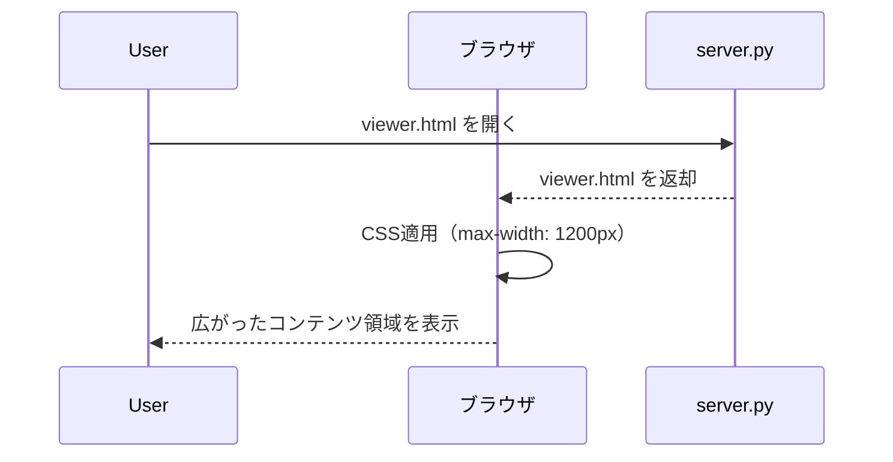
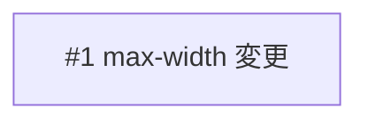

# annotation-viewer の横幅拡大

## 概要

annotation-viewer（plan.md をブラウザでレビューするための単一 HTML ファイル）のコンテンツ領域が狭く、長い表やコードブロックが横スクロールになりやすい。`.container` の `max-width` を 960px から 1200px に拡大し、レビュー時の可読性を向上させる。

## 確認事項

| # | 項目 | 根拠 | ステータス |
|---|------|------|-----------|
| 1 | 拡大後の max-width の具体値 | 1200px を想定しているが、1280px 等の方が適切な場合もある | ✅確認済み |
| 2 | コメントボタン（`.comment-btn` `left: -36px`）が container 外にはみ出さないか | `.content` の `padding: 40px 48px` 内に収まるため問題なし。container の padding 24px ではなく content の padding 48px が基準 | ✅問題なし（解決済み） |
| 3 | ブロックコメントボタン（`.block-comment-btn` `left: -28px`）の表示位置 | `.content` の `padding: 40px 48px` 内に収まるため問題ない想定 | ✅確認済み |
| 4 | ヘッダー・タブバーの幅制約の有無 | ヘッダー・タブバーに max-width 指定なし。ビューポート全幅の flexbox レイアウトのためバランス崩れなし | ✅問題なし（解決済み） |

## スコープ

### やること

- `.container` の `max-width` を 960px から 1200px に変更

### やらないこと

- `server.py` の変更
- 新規ファイルの追加
- レスポンシブ対応（ブレイクポイントの追加等）
- `.content` の padding 変更
- コメントボタンの位置調整

## 受入条件

- [ ] AC-1: `.container` の `max-width` が 1200px に変更されている
- [ ] AC-2: コメントボタン（セクション・ブロック）が幅拡大後も正しい位置に表示される
- [ ] AC-3: ヘッダー・タブバーとコンテンツ領域のバランスが保たれている

## 非機能要件

特になし

## データフロー



## フロントエンド変更

### 画面・UI設計

- `.container` の `max-width` を 960px から 1200px に変更する
- 他の CSS プロパティは変更しない
- コンテンツ領域が左右に約 120px ずつ広がる

### ワイヤーフレーム

#### 変更前（960px）

```
|<--- viewport --->|
|  +--[960px]----+ |
|  | header/tabs | |
|  | +----------+| |
|  | | content  || |
|  | +----------+| |
|  +--------------+ |
```

#### 変更後（1200px）

```
|<----- viewport ----->|
| +----[1200px]------+ |
| | header/tabs      | |
| | +--------------+ | |
| | | content      | | |
| | +--------------+ | |
| +------------------+ |
```

### 対象ファイル

- 変更: `scripts/annotation-viewer/viewer.html` — `.container` の `max-width` を変更

## 設計判断

| 判断事項 | 選択 | 理由 | 検討した代替案 |
|---------|------|------|--------------|
| max-width の値 | 1200px | 一般的なワイドレイアウトの幅。表やコードブロックの可読性が向上する | 1280px — やや広すぎて余白が少なくなる環境がある |
| padding の変更 | 変更しない | 幅拡大だけで十分な可読性改善が見込める | padding を 48px → 64px に拡大 — 過剰な変更 |

## システム影響

### 影響範囲

- annotation-viewer の表示レイアウトのみ

### リスク

- 小さいディスプレイ（1280px 以下）では横スクロールが発生する可能性があるが、レスポンシブ対応はスコープ外

## 実装タスク

### 依存関係図



### タスク一覧

| # | タスク | 対象ファイル | 見積 | 依存 |
|---|--------|------------|------|------|
| 1 | `.container` の `max-width` を 960px から 1200px に変更 | `scripts/annotation-viewer/viewer.html` | S | - |

> 見積基準: S(~1h), M(1-3h), L(3h~)

## テスト方針

### トレーサビリティ

| 受入条件 | 自動テスト | 手動検証 |
|---------|-----------|---------|
| AC-1 | - | MV-1 |
| AC-2 | - | MV-2 |
| AC-3 | - | MV-3 |

### 自動テスト

該当なし（CSS の変更のみのため、自動テストの対象外）

### ビルド確認

```bash
cd scripts/annotation-viewer && python3 server.py  # ローカルサーバー起動して目視確認
```

### 手動検証チェックリスト

- [ ] MV-1: ブラウザで annotation-viewer を開き、コンテンツ領域が従来より広くなっていること
- [ ] MV-2: セクションホバー時のコメントボタンおよびブロックホバー時のコメントボタンが正しい位置に表示されること
- [ ] MV-3: タブ切り替えが正常に動作し、ヘッダー・タブバーとコンテンツ領域のバランスが崩れていないこと
